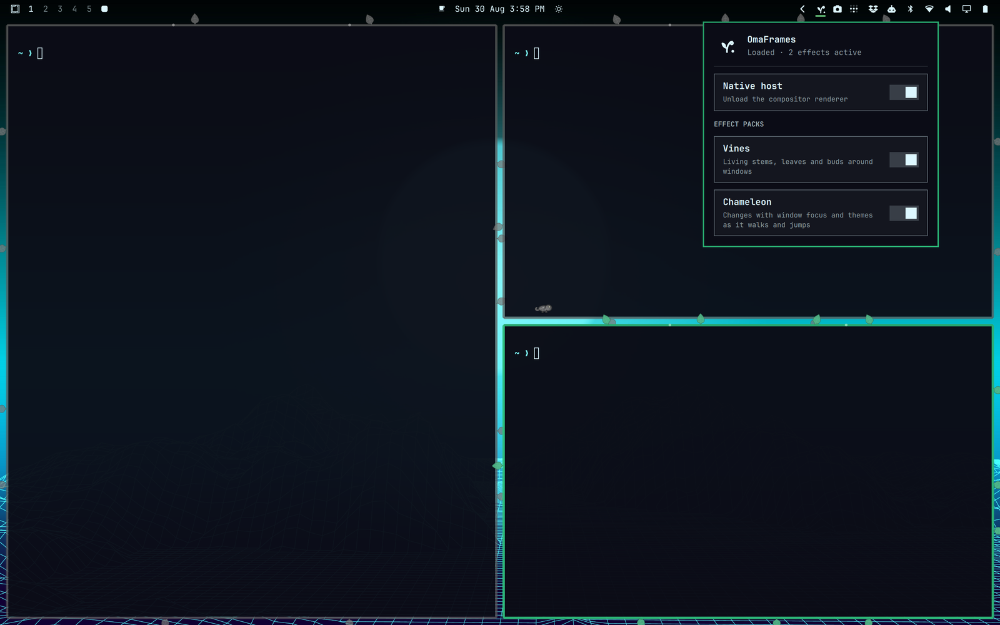

# OmaFrames

Playful, extensible window decorations for Omarchy and Hyprland.



OmaFrames is an effect engine rather than a single vine decoration.
The host owns Hyprland integration and effect lifecycle; individual packs own
their visuals and settings. **Vines** frames each window; **Chameleon** adds one
small, color-shifting chameleon that walks those edges and jumps between nearby
windows. Its name reflects how it adopts active and inactive window colors as
it moves, and changes with the current Omarchy theme.

This repository currently contains:

- a standalone Qt 6/QML study for previewing Vines and Chameleon together;
- a native Hyprland plugin that renders both packs against live window geometry
  inside the compositor.

The product is hybrid: native rendering for exact window geometry, plus an
Omarchy Quickshell bar widget for host and effect controls. See
[the architecture notes](docs/ARCHITECTURE.md) and
[the effect-pack contract](docs/PACKS.md).

The companion lives in `shell/`: an Omarchy bar widget with a small sprout icon,
a HyprPM host switch, and live Vines and Chameleon toggles. An optional
`pluginPath` setting can point at a development build instead.

## Install

OmaFrames has two parts because Omarchy shell plugins are QML-only while the
window effects run inside Hyprland. Install the ABI-matched native host with
HyprPM, then install the bar widget through Omarchy:

```bash
hyprpm add https://github.com/bitshaker/omaframes
hyprpm enable omaframes
omarchy plugin add https://github.com/bitshaker/omaframes.git --enable
```

Left-click the sprout icon to open the pack panel. Right-click enables or
disables the native host, and middle-click refreshes its status. Vines and
Chameleon can be toggled independently without reloading the host.

Update both managed checkouts with:

```bash
hyprpm update
omarchy plugin update bitshaker.omaframes
```

Remove OmaFrames cleanly with:

```bash
hyprpm disable omaframes
omarchy plugin remove bitshaker.omaframes
hyprpm remove omaframes
```

No persistent Hyprland configuration is required. Removing the Omarchy plugin
removes its bar entry; disabling and removing the HyprPM plugin unloads the
native code and removes HyprPM's managed build.

## Compatibility and status

OmaFrames 0.5.0 is a public beta. The QML study has been linted and rendered.
The native plugin has been compiled and live-tested against Hyprland 0.56.2 at
commit `efb50993780079460b0cbed1363e2166a2de1d9f`. HyprPM builds against the
running Hyprland version and uses release commit pins for supported versions;
the plugin also refuses to load if its build headers do not match the running
compositor. Existing and newly opened windows, HiDPI rendering, floating
move/resize, maximize/fullscreen,
workspace movement, live settings, five concurrent Foot windows, repeated
load/unload, and clean decoration removal have passed. Native clockwise growth,
staged sprouts, motion disablement, per-window procedural leaf layouts, and live
Retro 82 ↔ Hackerman theme changes also pass. Mixed-monitor and long-running
performance tests remain.

Chameleon passes the deterministic QML study, clean native build, ABI guard,
plugin registration, attachment to existing/new windows, runtime configuration,
and a 2× live render. Recorder-free follow-up testing also passed visible
perimeter walking, deterministic jumps, closing a destination mid-flight,
floating resize, empty-workspace and fullscreen recovery, reduced motion,
runtime disable/re-enable, a 12-jump soak, and clean unload. Mixed-monitor and
long-running performance tests remain. The separate AMD encoder incident is
documented in [the incident report](docs/INCIDENT_2026-08-30.md).

OmaFrames runs as unsandboxed native code inside Hyprland, and the bar widget
invokes `hyprpm` and `hyprctl` with fixed argument arrays. Review the source
before installing and save work before enabling a new compositor plugin.
HyprPM builds the native host locally and may request the privileges needed to
prepare matching Hyprland headers or system development packages. The Omarchy
plugin installer only clones and validates the QML checkout; it does not run a
build hook or use `sudo`.

See [SECURITY.md](SECURITY.md) for the runtime boundary and vulnerability
reporting guidance.

## Effect packs

`vines` and `critter` are built-in pack IDs; the latter is presented as
Chameleon. Their QML and native sources live under matching `packs/<id>`
directories and are registered through one small compile-time host registry.

Ideas such as frost, embers, stars, moss, circuits, or seasonal frames can
become later packs while sharing one compositor integration.

## QML visual study

Requirements:

- Qt 6.10 or newer (`ShapePath.trim` is used for the growth reveal);
- `qmlscene6` or `qml6`;
- Qt Quick Controls and Qt Quick Shapes.

Run the interactive study:

```bash
./scripts/run-qml-prototype
```

Capture the deterministic QML study image:

```bash
./scripts/capture-qml-prototype
```

The study capture is written to `captures/qml-study.png`. It is asset-free: its
vines and chameleon are QML vector paths and
primitives. It animates walking, crouching, a curved inter-window flight, and
landing around two simulated windows.

## Native plugin

Requirements:

- Hyprland development headers matching the running compositor exactly;
- a C++23 compiler;
- the development packages exposed by Hyprland's `pkg-config` metadata.

Build it:

```bash
make -C native
```

The output is `native/omaframes-native.so`. It checks the running Hyprland hash
during initialization and refuses to load against mismatched headers.

The root [`hyprpm.toml`](hyprpm.toml) is the supported distribution path. A
manual build is intended for development and testing.

## Omarchy bar widget development

The repository root is the Omarchy `bar-widget` plugin; its manifest loads
`shell/Panel.qml`. For local development, link the checkout into the user plugin
directory, enable it, and point the widget at the local native build:

```bash
ln -s "$PWD" ~/.config/omarchy/plugins/bitshaker.omaframes
omarchy plugin enable bitshaker.omaframes
omarchy bar set bitshaker.omaframes pluginPath "$PWD/native/omaframes-native.so"
```

Clear `pluginPath` to return the widget to HyprPM management:

```bash
omarchy bar set bitshaker.omaframes pluginPath ""
```

Vines grows clockwise once when it attaches to a window. Hyprland's normal
border stays in place while the effect renders outside it. By default, the
stem, leaves, and buds derive from each window's resolved border gradient, so
active/inactive state, window rules, and Omarchy theme changes flow through
without parsing theme files. Heart-shaped leaves are generated from vector
curves in memory, then placed at stable pseudo-random intervals with three tilt
variants. Windows of the same size therefore do not receive identical foliage,
but a window's layout does not jitter from frame to frame.

Chameleon is one global, click-through actor rather than one pet per window.
It idles and walks around all four edges of its host, then selects one of the
three nearest eligible windows on the same visible workspace and monitor. A
short crouch leads into a compositor-global arcing flight, followed by a
landing pose and ownership transfer. Reduced-motion mode parks it on the active
window and disarms its animation timer.


The compositor test matrix is documented in
[the live-test report](docs/LIVE_TEST.md).

### Manual live test

A native Hyprland plugin can crash the compositor. Save work first and have a
TTY available:

```bash
hyprctl plugin load "$PWD/native/omaframes-native.so"
```

Unload it with:

```bash
hyprctl plugin unload "$PWD/native/omaframes-native.so"
```

The Vines pack exposes these runtime values:

```text
plugin:omaframes:vines:enabled
plugin:omaframes:vines:animation_enabled
plugin:omaframes:vines:growth_duration_ms
plugin:omaframes:vines:theme_aware
plugin:omaframes:vines:stem_thickness
plugin:omaframes:vines:extent
plugin:omaframes:vines:leaf_size
plugin:omaframes:vines:col.stem
plugin:omaframes:vines:col.leaf
plugin:omaframes:vines:col.bud
```

Hyprland 0.56 uses the Lua config API for transient changes. For example:

```bash
hyprctl eval 'hl.config({ plugin = { omaframes = { vines = { enabled = false } } } })'
hyprctl eval 'hl.config({ plugin = { omaframes = { vines = { enabled = true } } } })'
hyprctl eval 'hl.config({ plugin = { omaframes = { vines = { animation_enabled = false } } } })'
```

`theme_aware` defaults to `true`. Set it to `false` to use the explicit
`col.stem`, `col.leaf`, and `col.bud` values instead. `growth_duration_ms`
defaults to 1800 and accepts 100–15000 milliseconds. The default extent is 18
logical pixels and the default leaf length is 16 logical pixels.

Chameleon exposes these compatibility-preserving `critter` config keys:

```text
plugin:omaframes:critter:enabled
plugin:omaframes:critter:motion_enabled
plugin:omaframes:critter:theme_aware
plugin:omaframes:critter:hide_on_fullscreen
plugin:omaframes:critter:size
plugin:omaframes:critter:walk_speed
plugin:omaframes:critter:jump_interval_ms
plugin:omaframes:critter:col.body
plugin:omaframes:critter:col.accent
```

The defaults are a 30-pixel chameleon, 44 logical pixels/second walking speed, and
roughly 12 seconds between jump opportunities.

While the plugin is loaded, its small diagnostic command reports the single
actor's live state and can request a jump through the normal state machine:

```bash
hyprctl omaframes status
hyprctl -j omaframes status
hyprctl omaframes jump
```

`jump` is intended for testing. It requires motion to be enabled, an eligible
active window, and at least one destination on the same visible workspace and
monitor. The command is unregistered when the plugin unloads.

## Verification

Validate the root Omarchy package, lint both QML surfaces, verify release
metadata and native exports, and rebuild the native plugin in one command:

```bash
./scripts/check
```

The marketplace [`preview.png`](preview.png) is resized directly from the live
anonymous-Foot-and-panel capture under `docs/`; it contains no generated or
redrawn content. Rebuild it with ImageMagick:

```bash
./scripts/build-preview
```

## License

[MIT](LICENSE)
