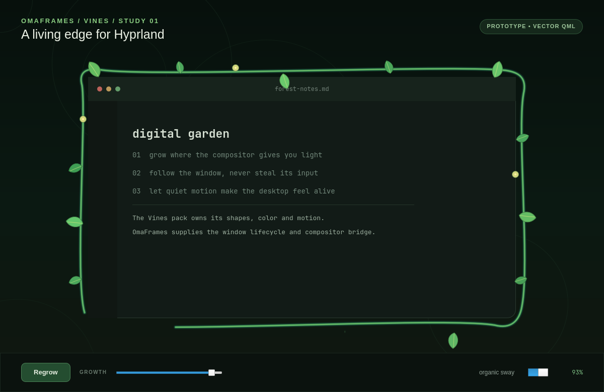

# OmaFrames

Playful, extensible window decorations for Omarchy and Hyprland.



OmaFrames is becoming an effect engine rather than a single vine decoration.
The host owns Hyprland integration and effect lifecycle; individual packs own
their visuals and settings. **Vines** is the first pack and the working proof
of that design.

This repository currently contains:

- a standalone Qt 6/QML study for developing and previewing the Vines look;
- a native Hyprland plugin that attaches the pack to real windows and renders
  its stem, leaves, and buds inside the compositor.

The intended product remains hybrid: native rendering for exact window
geometry, plus a Quickshell/QML companion for previews, palettes, controls, and
reduced-motion settings. See [the architecture notes](docs/ARCHITECTURE.md) and
[the effect-pack contract](docs/PACKS.md).

## Status

Prototype only. The QML study has been linted and rendered. The native plugin
has been compiled and live-tested against Hyprland 0.56.2. Existing and newly
opened windows, HiDPI rendering, floating move/resize, maximize/fullscreen,
workspace movement, live settings, five concurrent Foot windows, repeated
load/unload, and clean decoration removal have passed. Mixed-monitor and
long-running performance tests remain.

## Effect packs

`vines` is the first built-in pack. Its QML and native sources live under
matching `packs/vines` directories so another effect can follow the same
boundary without being tangled into the host.

Ideas such as frost, embers, stars, moss, circuits, or seasonal frames can
become later packs while sharing one compositor integration.

## QML visual study

Requirements:

- Qt 6.10 or newer (`ShapePath.trim` is used for the growth reveal);
- `qmlscene6` or `qml6`;
- Qt Quick Controls and Qt Quick Shapes.

Run the interactive study:

```bash
./scripts/run-qml-prototype
```

Regenerate the deterministic preview image:

```bash
./scripts/capture-qml-prototype
```

The study is asset-free: its stems, leaves, veins, and buds are QML vector
paths and primitives.

## Native plugin

Requirements:

- Hyprland development headers matching the running compositor exactly;
- a C++23 compiler;
- the development packages exposed by Hyprland's `pkg-config` metadata.

Build it:

```bash
make -C native
```

The output is `native/omaframes-native.so`. It checks the running Hyprland hash
during initialization and refuses to load against mismatched headers.


The compositor test matrix is documented in
[the live-test report](docs/LIVE_TEST.md).

### Optional live test

A native Hyprland plugin can crash the compositor while it is experimental.
Save work first and have a TTY available:

```bash
hyprctl plugin load "$PWD/native/omaframes-native.so"
```

Unload it with:

```bash
hyprctl plugin unload "$PWD/native/omaframes-native.so"
```

The Vines pack exposes these runtime values:

```text
plugin:omaframes:vines:enabled
plugin:omaframes:vines:stem_thickness
plugin:omaframes:vines:extent
plugin:omaframes:vines:leaf_size
plugin:omaframes:vines:col.stem
plugin:omaframes:vines:col.leaf
plugin:omaframes:vines:col.bud
```

Hyprland 0.56 uses the Lua config API for transient changes. For example:

```bash
hyprctl eval 'hl.config({ plugin = { omaframes = { vines = { enabled = false } } } })'
hyprctl eval 'hl.config({ plugin = { omaframes = { vines = { enabled = true } } } })'
```

## Verification

Run the QML linter and rebuild the native plugin in one command:

```bash
./scripts/check
```

## License

[MIT](LICENSE)
