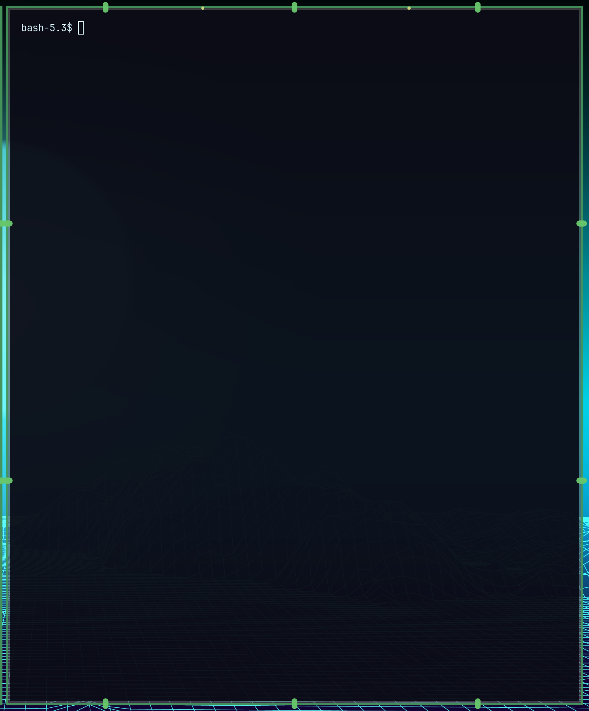

# Native live-test report

Date: 2026-08-29

The first native compositor test used the locally installed Hyprland 0.56.2.
The running compositor and development headers both identified the exact commit
`efb50993780079460b0cbed1363e2166a2de1d9f` before the plugin was loaded.

## Passed

| Check | Result |
|---|---|
| Qt 6 lint and deterministic QML render | Pass |
| Clean C++23 native build | Pass |
| Required Hyprland plugin exports | Pass |
| Runtime ABI/hash guard | Pass |
| Plugin load and registration | Pass |
| Attachment to a window that existed before load | Pass |
| Attachment to a Foot window opened after load | Pass |
| Runtime option registration | Pass |
| Stem, leaves, and buds visible in the compositor | Pass |
| HiDPI scaling | Pass |
| Decoration removal on unload | Pass |
| Two consecutive load/unload cycles | Pass |
| Compositor responsive after cleanup | Pass |

The Foot window was captured as a 725×874 logical-pixel region and produced a
1450×1748 image, confirming correct rendering on the monitor's 2× scale. The
window's decoration list reported `OmaVines prototype` at priority 9980 while
loaded and no longer reported it after unload.

## Still to test

- floating, maximized, and fullscreen windows;
- multiple monitors and mixed monitor scales;
- rapid move/resize and workspace animations;
- runtime setting changes and reduced-motion behavior;
- many simultaneous windows and GPU/damage performance;
- compositor upgrades and HyprPM compatibility pins.

The plugin was unloaded after testing, the disposable Foot window was closed,
and no Hyprland or Omarchy configuration was changed.
