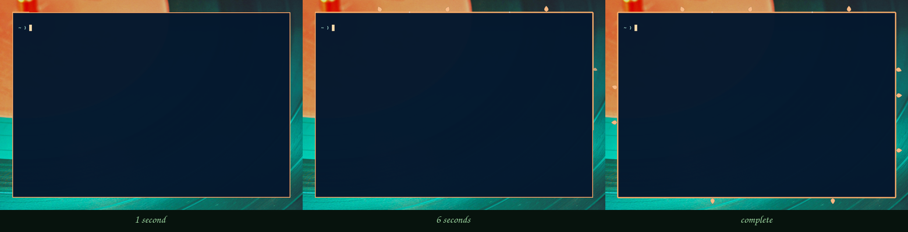
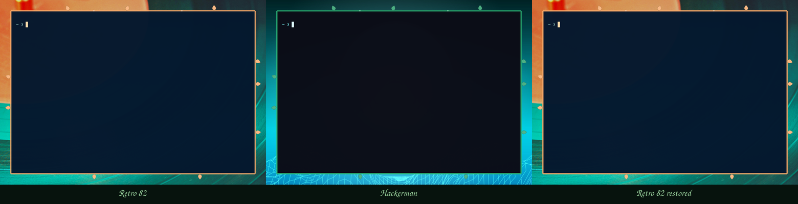
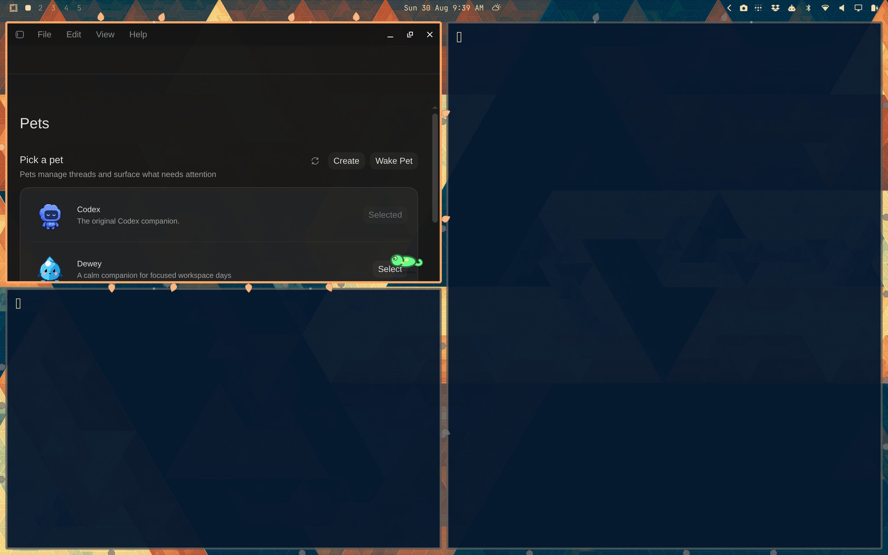

# Native live-test report

Date: 2026-08-29

The first native compositor test used the locally installed Hyprland 0.56.2.
The running compositor and development headers both identified the exact commit
`efb50993780079460b0cbed1363e2166a2de1d9f` before the plugin was loaded.

The OmaFrames/Vines pack refactor was smoke-tested against the same compositor.
The renamed plugin registered as `omaframes` version `0.2.0-prototype`, and the
active window reported `OmaFrames: Vines` at priority 9980. The nested
`plugin:omaframes:vines:enabled` value toggled false and true through
`hl.config`, proving the pack namespace is live. Unload removed both the plugin
and decoration, with no Hyprland config errors before or after cleanup.

The animated, theme-aware prototype was then tested as version
`0.3.0-prototype`. A centered floating Foot window retained Hyprland's standard
border while the Vines stem advanced clockwise from the top edge through the
right, bottom, and left edges. Leaves and buds appeared only after the stem
reached their perimeter positions. The default 1800 ms duration and a slowed
12000 ms diagnostic run both completed without stalling the compositor.

With animation disabled to isolate color behavior, the same live Foot window
was captured under Solitude, Hackerman, and Solitude again. Vines followed the
resolved gray and green window-border palettes immediately, and the restored
Solitude frame matched the first capture.

The natural-leaf prototype was then tested as version `0.4.0-prototype`.
Heart-shaped leaves are rasterized from in-memory Cairo curves at three tilt
angles for each edge. Two 720×480 Foot windows received visibly different,
stable counts and positions. A 15000 ms run confirmed that the randomized
leaves and their small individual delays still remain behind the clockwise stem
reveal.

The texture palette was exercised through Retro 82 → Hackerman → Retro 82.
Leaves, veins, stem, and buds changed from orange to green and back without a
plugin reload, layout shift, config error, or compositor error.

A growth-stall regression was then isolated and tested as version
`0.4.1-prototype`. The original renderer listened to Hyprland's generic
animation tick, which goes idle when the compositor has no active native
animation. A vine could therefore freeze near the end of a window-opening
animation and jump to its time-based completed state only after focus or a
screenshot caused fresh damage.

The replacement uses a short-lived Hyprland event-loop timer to damage the
window throughout growth and once at completion. An existing focused ChatGPT
window completed an 8000 ms diagnostic run without a focus change. A Foot
window launched through Omarchy's actual `omarchy-launch-terminal` path then
completed a 3000 ms run without the old workaround; the result was also
confirmed directly in the live compositor. No persistent config was changed.

## Passed

| Check | Result |
|---|---|
| Qt 6 lint and deterministic QML render | Pass |
| Clean C++23 native build | Pass |
| Required Hyprland plugin exports | Pass |
| Runtime ABI/hash guard | Pass |
| Plugin load and registration | Pass |
| OmaFrames host and Vines pack namespace | Pass |
| Attachment to a window that existed before load | Pass |
| Attachment to a Foot window opened after load | Pass |
| Runtime option registration | Pass |
| Stem, leaves, and buds visible in the compositor | Pass |
| Heart-shaped leaf silhouette and visible tilt variants | Pass |
| Variable stable layout across same-sized Foot windows | Pass |
| Per-window clockwise stem growth | Pass |
| Growth continues after Hyprland's opening animation becomes idle | Pass |
| Final completed frame without focus or screenshot damage | Pass |
| Exact Omarchy Foot launcher regression path | Pass |
| Randomized leaves and buds staged behind stem progress | Pass |
| Standard Hyprland border retained | Pass |
| Runtime animation disable | Pass |
| Live Solitude → Hackerman → Solitude inheritance | Pass |
| Live Retro 82 → Hackerman → Retro 82 texture regeneration | Pass |
| HiDPI scaling | Pass |
| Tiled to floating transition | Pass |
| Floating move and resize to 640×480 | Pass |
| Maximized transition and restoration | Pass |
| True fullscreen transition and restoration | Pass |
| Workspace 1 → 3 → 1 transition | Pass |
| Runtime disable and re-enable | Pass |
| Live thickness, extent, and leaf-size changes | Pass |
| Five simultaneous decorated Foot windows | Pass |
| Sequential client removal and repeated relayout | Pass |
| Decoration removal on unload | Pass |
| Three consecutive load/unload cycles | Pass |
| Relevant Hyprland rolling-log errors | None |
| Hyprland config errors after cleanup | None |
| Compositor responsive after cleanup | Pass |

The Foot window was captured as a 725×874 logical-pixel region and produced a
1450×1748 image, confirming correct rendering on the monitor's 2× scale. The
window's decoration list reported the Vines decoration at priority 9980 while
loaded and no longer reported it after unload.

The expanded state test moved a floating Foot window, resized it to 640×480,
toggled maximized and true fullscreen states, moved it from workspace 1 to 3
and back, then disabled and re-enabled rendering through `hl.config`. Runtime
geometry was increased from the then-current defaults `(3, 16, 13)` to
`(6, 24, 20)` for stem thickness, extent, and leaf size; the decoration
repositioned cleanly. The natural-leaf prototype now defaults to `(3, 18, 16)`.

Five Foot windows were then decorated simultaneously. Every client reported
the Vines decoration, and closing four clients sequentially produced clean
relayouts. In true fullscreen the outward decoration is clipped beyond the
screen edge, so no vines remain visible and no corruption appears.

## Findings

- Adjacent decorated edges can become visually busy where tiled windows meet.
- The procedural count is capped per edge, but a production renderer should
  still reduce detail below a size threshold and offer an active-window-only
  mode.
- Each decorated window currently owns twelve 96×96 leaf textures. The cache is
  small in practice, but many-window GPU memory and transition churn still need
  formal profiling.
- Runtime controls must use Hyprland's Lua `hl.config(...)` API; the legacy
  `hyprctl keyword` path is unavailable with the Lua config provider.
- A full-border render call cannot be progressively clipped in this path;
  explicit perimeter segments provide a reliable prototype reveal.
- Hyprland's generic animation tick is conditional on native animated
  variables and cannot drive an independent plugin animation. OmaFrames now
  owns a timer that disarms as soon as each vine finishes growing.

## Still to test

- multiple monitors and mixed monitor scales (only one monitor is connected);
- a longer rapid move/resize and workspace-animation soak;
- GPU/damage profiling and long-running many-window performance;
- active-window-only behavior and integration with a host-wide reduced-motion
  preference (the pack-level animation toggle works);
- compositor upgrades and HyprPM compatibility pins.

The plugin was unloaded after testing, all disposable Foot windows were
removed, the theme was restored to the user's starting theme, and no persistent
Hyprland or Omarchy configuration file was edited manually.

## Chameleon live test

Date: 2026-08-30

OmaFrames `0.5.0-prototype` loaded against the same Hyprland 0.56.2 commit. The
pack registry attached one `OmaFrames: Vines` decoration at priority 9980 and
one `OmaFrames: Chameleon` decoration at priority 9970 to the existing ChatGPT
window and two Foot windows opened after load. No config errors appeared. The
perimeter walker was also confirmed directly on-screen rather than inferred
only from compositor state.

Transient Lua configuration changed jump interval, walk speed, size, palette,
and reduced-motion state. The chameleon parked when motion was disabled and
resumed when re-enabled. A high-contrast diagnostic chameleon rendered on a shared
tiled edge; the normal product default remains 30 logical pixels.

The initial run then attempted a full-screen recording. The AMD VCE encode ring
timed out in `gpu-screen-recorder`, the ChatGPT GPU process dumped core, GPU
recovery failed, and the graphical session could not be restored without
rebooting. The journal timeline points to the video encoder as the initiating
failure. See the full [incident report](INCIDENT_2026-08-30.md).

Follow-up testing after reboot used only Hyprland IPC, state sampling, and one
still image; the video recorder was not run again. A new `hyprctl omaframes`
diagnostic command exposed the phase, host, target, eligible-target count,
visibility, and actor box, plus a deterministic `jump` action that enters the
normal crouch/flight/landing state machine.

A 50 ms trace of one forced jump observed five crouching samples, nine airborne
samples, four landing samples, and a settled idle state. During flight the
actor's vertical coordinate traced the expected arc and ownership transferred
between adjacent Foot windows without a duplicate or missing settled actor.

The destination Foot process was then terminated during the airborne phase.
The target reference cleared, the actor returned to walking on the surviving
host, and Hyprland remained responsive. True fullscreen produced a hidden
phase with no actor and restoration rehomed it safely. Switching to an empty
workspace did the same, then returning to workspace 1 restored the actor.

With motion disabled, the actor parked on the active Foot window and the
diagnostic jump correctly refused to start. It resumed and completed a jump
after motion was re-enabled. Runtime `enabled=false` hid the actor and
`enabled=true` restored it. While parked, tile → float → resize → tile
changed the actor box with the live window geometry. A 12-jump state-polled soak
then completed every flight and left the compositor responsive.

Finally, transient settings were restored to product defaults, the disposable
Foot window was closed, and the plugin was unloaded while its animation timer
was active. Both OmaFrames decorations disappeared, the diagnostic command was
unregistered, the plugin list was empty, and Hyprland reported no config
errors.

### Chameleon results

| Check | Result |
|---|---|
| Visible perimeter walking on live tiled windows | Pass |
| Exactly one actor across three decorated windows | Pass |
| Crouch → airborne arc → landing → ownership transfer | Pass |
| Destination window closed while airborne | Pass |
| One-window stability and safe refusal without a target | Pass |
| Zero-window workspace hide and restoration | Pass |
| True fullscreen hide and restoration | Pass |
| Tiled, floating, resized, and restored geometry tracking | Pass |
| Reduced-motion park, refusal, and resume | Pass |
| Runtime disable and re-enable | Pass |
| Live size, speed, interval, palette, and theme settings | Pass |
| Twelve consecutive deterministic jumps | Pass |
| Timer, decorations, render passes, and command removed on unload | Pass |
| Hyprland config errors after cleanup | None |
| Mixed-monitor and mixed-scale behavior | Not tested; one monitor connected |
| Long-running GPU/damage profiling | Not yet tested |

## Boundary-aware rail follow-up

Date: 2026-08-30

An edge-tiled window exposed a clipping bug in the original rail geometry. The
actor center sat 42% of its size outside every window edge; where the window
was only 12 logical pixels from the output boundary, most of the chameleon was
off-screen.

The corrected rail checks available outward clearance against the actor's full
box. Internal edges retain the original outward pose. Output-boundary edges
flip the normal and use the opposite wall pose, with facing reversed so the
head still follows the direction of travel. A final logical-bounds clamp covers
flush edges, corners, landings, and the airborne arc.

On the 1440×900 logical, 2× output, the exact rebuilt plugin reached ChatGPT's
left edge with `inward=true` and a complete 30-pixel actor box spanning
`x=9.6…39.6`. A still image confirmed the whole mirrored creature was visible.
A forced jump then sampled every visible actor box inside the output; the top
of its arc stopped at `y=1`, landed on a Foot window, and settled normally.
Transient settings were restored, the plugin unloaded cleanly, the user's
windows were untouched, and Hyprland reported no config errors.

## Dwindle occlusion-aware rail follow-up

Date: 2026-08-30

The occlusion rule was tested on a disposable workspace with two 701×850 Foot
windows in Hyprland's side-by-side dwindle layout. Testing used Hyprland IPC and
status sampling only; no screen recorder or video encoder was started.

With the left window as the inactive host and the right tiled window active, an
actor on the shared right rail moved from outward `x=710.6` to inward `x=685.4`
and reported `placement="tiled-occlusion-inward"`. Focusing the host restored
`placement="outward"`. Fast IPC traces captured both 180 ms crossings as a
single actor moved through intermediate positions; the `transitioning` flag
cleared at the destination and no second actor state appeared.

A third Foot window was floated and left active. Its animated box overlapped
the actor box at `x=710.6`, `y=514.991`, but the actor correctly remained
outward. The tiled window behind the same rail was inactive and therefore did
not affect placement. This confirmed that the decision uses the active
window's floating state and the actor's actual rail position rather than broad
window adjacency.

A forced jump from the active left window to the inactive right window reported
`destinationPlacement="tiled-occlusion-inward"` throughout flight. The landing
pose settled on the destination's shared left rail with the same placement
reason. All 18 crouch, flight, landing, and idle samples contained one visible
actor, and every sampled box stayed inside the 1440×900 logical output.

The existing output-boundary behavior was retested on the right window's outer
rail. Status reported `placement="monitor-boundary-inward"` at
`x=1400.4`, and the complete 30-pixel actor box remained within the logical
monitor. Normal internal placement, tiled occlusion, and monitor clipping are
now independently visible through `hyprctl -j omaframes status` as `outward`,
`tiled-occlusion-inward`, and `monitor-boundary-inward`; airborne status also
reports its destination placement.

The complete offline check passed, including QML lint, Omarchy shell-plugin
validation, a clean C++23 build, and export checks. Product-default runtime
values were restored, all three disposable Foot windows were closed, workspace
1 and the original ChatGPT focus were restored, and the plugin unloaded with
its control command removed. No plugins remained loaded and Hyprland reported
no configuration errors.

### Occlusion-aware results

| Check | Result |
|---|---|
| Inactive host under active tiled overlap flips inward | Pass |
| Exact actor-box intersection rather than broad adjacency | Pass |
| Active host restores outward placement | Pass |
| Active floating overlap remains outward | Pass |
| Non-occluded internal placement remains outward | Pass |
| Walking, idle, landing, and jump destination classification | Pass |
| Smooth focus transitions with one actor and bounded damage | Pass |
| Existing monitor-boundary inward placement and bounds | Pass |
| Forced jump and focus changes leave one actor | Pass |
| Complete offline check | Pass |
| Transient settings, windows, workspace, focus, and unload cleanup | Pass |
| Hyprland config errors after cleanup | None |
